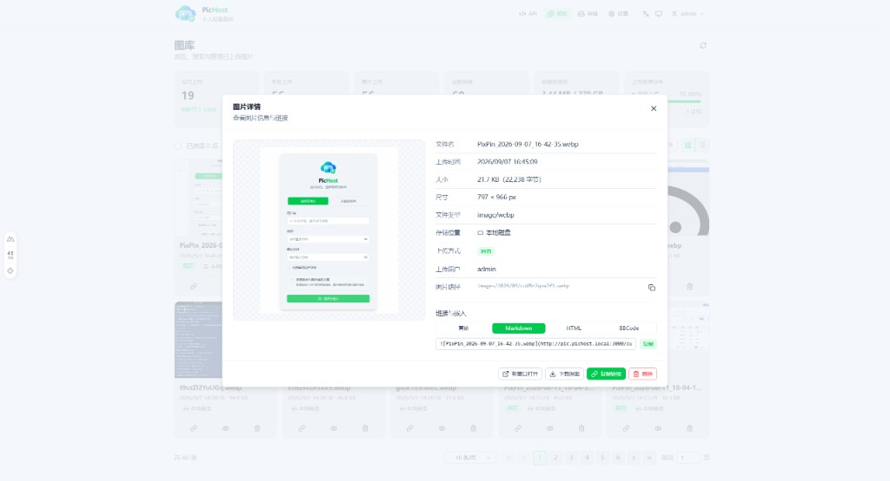
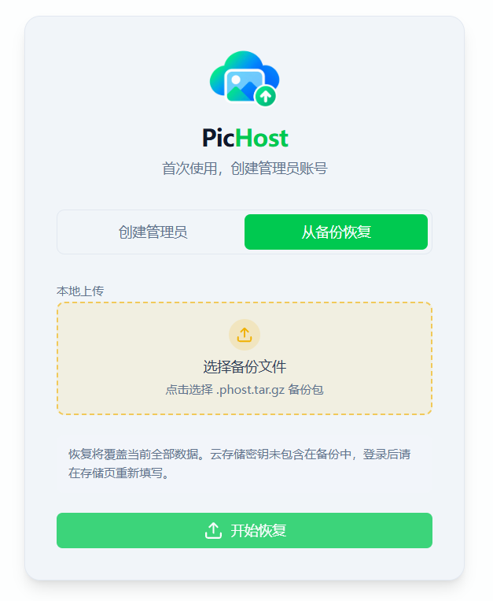
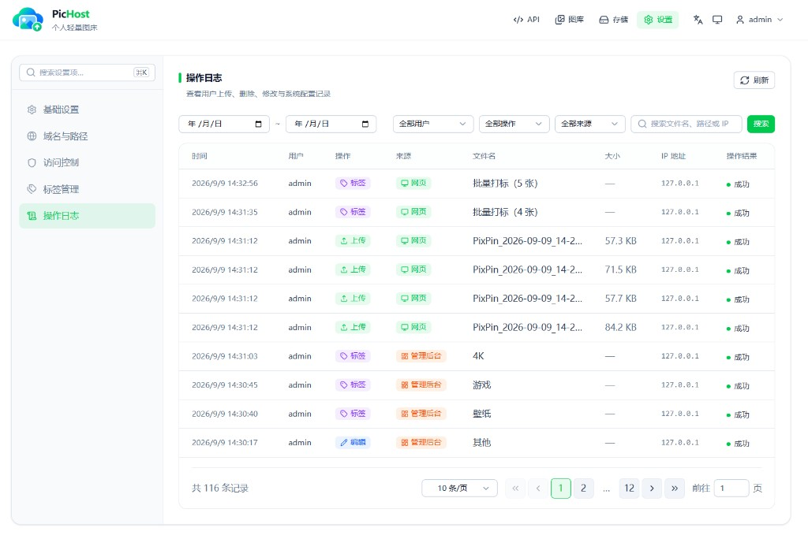

<p align="center">
  
</p>

<h1 align="center">PicHost</h1>

<p align="center"><strong>个人轻量图床</strong> · 图片放好，管理也要顺手</p>

<p align="center">自托管图床 / 多用户 / Docker / API / Twikoo · 本地磁盘或对象存储</p>

<p align="center">
  <a href="https://github.com/O96u/PicHost/blob/main/package.json"></a>
  <a href="https://github.com/O96u/PicHost/actions/workflows/ci.yml"></a>
  
  <a href="https://hub.docker.com/r/muxui/pichost"></a>
  
</p>

<p align="center">
  <a href="https://o96u.github.io/PicHost/">文档</a> ·
  <a href="#界面预览">预览</a> ·
  <a href="#特性">特性</a> ·
  <a href="#技术栈">技术栈</a> ·
  <a href="#快速开始">快速开始</a> ·
  <a href="README.en.md">English</a>
</p>

---

## 界面预览

**main** 分支暂无公网演示；**cloudflare** 分支在线体验：[pic.roven.cc](https://pic.roven.cc)

| 上传 | 图库 |
| :--: | :--: |
|  |  |

| API | 标签管理 |
| :--: | :------: |
|  |  |

| 存储 | 设置 |
| :--: | :--: |
|  |  |

| 首次设置 | 从备份恢复 |
| :--: | :--: |
|  |  |

| 操作日志 |
| :------: |
|  |

## 特性

- **拖拽 / 点击 / Ctrl+V 粘贴**上传；服务端 WebP 压缩、Referer 防盗链
- **多用户**：账号密码登录（滑块 / Turnstile / Cap 人机验证）、可选开放注册；普通用户仅见自己的图片
- **多后端存储**：本地磁盘 + S3 兼容（R2 / COS / OSS / AWS）；混合直链 `proxy` / `public`
- **图库**：浏览、搜索、按存储/来源/标签筛选、网格/列表切换、批量删除与批量打标；统计概览与来源分布；点击图片查看详情与多格式链接
- **标签**：每用户独立标签、彩色标记；上传后单张/批量打标；设置页管理（新建、改色、合并、删除）；API 支持 `tagIds` 与批量打标
- **备份与迁移**：整站导出/恢复（`.phost.tar.gz`）、跨后端同步；setup 未初始化时可从备份恢复
- **API 与 Twikoo**：全局 / 个人 Token；`POST /api/index.php` 兼容
- **Docker 零配置**：首次访问 Web 引导创建管理员

## 技术栈

| 层级 | 技术 |
| ---- | ---- |
| 前端 | [Nuxt 4](https://nuxt.com) · [Nuxt UI 4](https://ui.nuxt.com) · [Vue 3](https://vuejs.org) · [Tailwind CSS 4](https://tailwindcss.com) · TypeScript |
| 后端 | [Nitro](https://nitro.build)（`node-server`）· REST API |
| 数据 | SQLite · 本地 `data/pichost.db` |
| 图片处理 | [sharp](https://sharp.pixelplumbing.com)（服务端 WebP 压缩） |
| 存储 | 本地磁盘 · S3 兼容（[AWS SDK](https://aws.amazon.com/sdk-for-javascript/) · R2 / COS / OSS 等） |
| 国际化 | [@nuxtjs/i18n](https://i18n.nuxtjs.org)（简体中文 / English） |
| 质量与文档 | [Vitest](https://vitest.dev) · [VitePress](https://vitepress.dev) 文档站 |
| 部署 | Docker · Node.js 22 |

## 快速开始

```bash
docker run -d \
  --name pichost \
  -p 6892:6892 \
  -v ./data:/data \
  --restart unless-stopped \
  muxui/pichost:latest
```

浏览器打开 `http://<主机IP>:6892`，按引导完成设置即可。

**详细说明**（环境变量、双域名、API、Twikoo、反向代理、本地开发等）见 **[用户文档](https://o96u.github.io/PicHost/)**。

| 分支 | 说明 |
| ---- | ---- |
| [**main**](https://github.com/O96u/PicHost/tree/main) | 默认主线：多后端、双域名、统一 `images/` 存储 |
| [**cloudflare**](https://github.com/O96u/PicHost/tree/cloudflare) | 仅 Cloudflare R2；在线演示 [pic.roven.cc](https://pic.roven.cc) |

## License

[GPL-3.0](LICENSE)

## 友链

[LINUX DO](https://linux.do/)
